# ChatServer

## 简介

技术支持：C++、 CMake、 C/S 模式、 Linux 环境、 boost、 布隆过滤器

功能： 

- 用户注册、 登录、 单聊、 群聊； 
- Redis 保存用户令牌短时间可免登录； 
- MySQL、 Redis 数据库连接池避免连接频繁创建和销毁； 
- boost 线程池实现多并发； 
- 布隆过滤器检测用户不在数据库中， 避免无权访问数据库  

## 编译运行

下载asio

```txt
https://pan.baidu.com/s/1uvZSBXs1ijGO3j8mhEQCdA?pwd=7777
```

编译

```txt
mkdir build
cd build
cmake ..
make
```

编译后项目目录

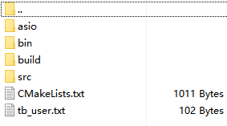

bin目录

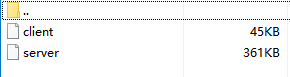

src目录

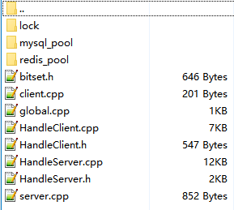

user表

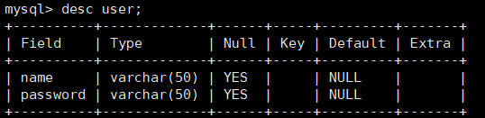


启动

```txt
./bin/server
./bin/client
```

服务端

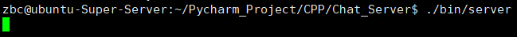

客户端

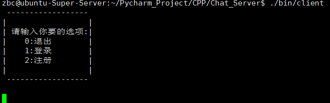

## 测试

### 注册

注册两个用户：zhangsan lisi

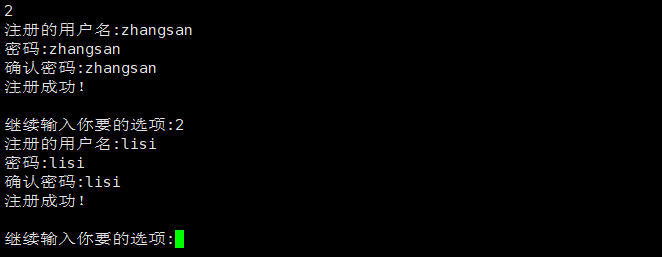

服务端显示

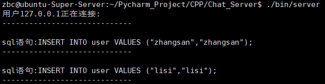

查看user表

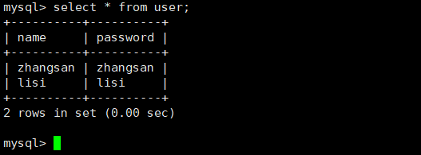

### 登录

登录用户zhangsan

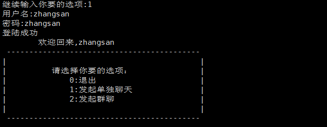

登录用户lisi

这里是用另一个linux用户登录的，所以提示文件无写入权限，无妨

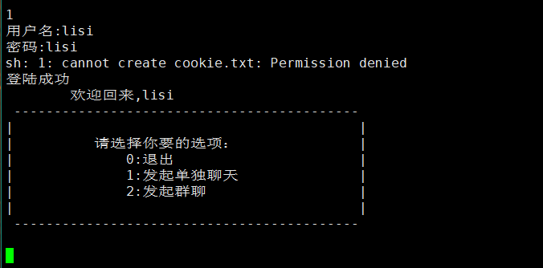

服务端显示

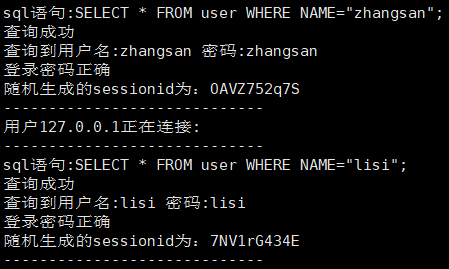

### 单聊

用户zhangsan显示


用户lisi显示

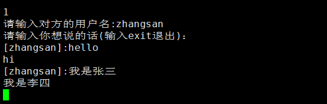

服务端显示

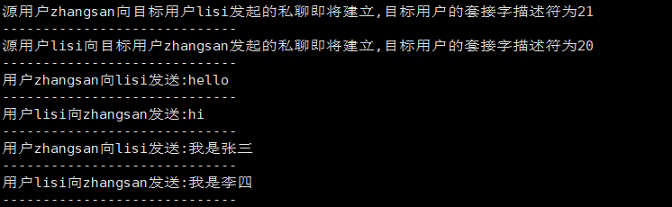

### 群聊

用户zhangsan显示


用户lisi显示

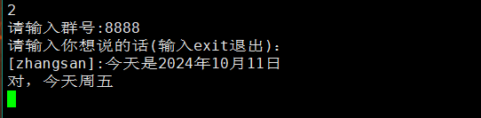

服务端显示

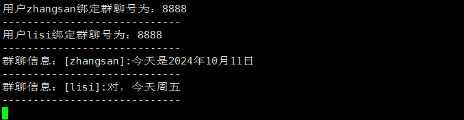

## 参考

```c++
chat_server: https://github.com/zk1556/chat_server_boost
```

# End
